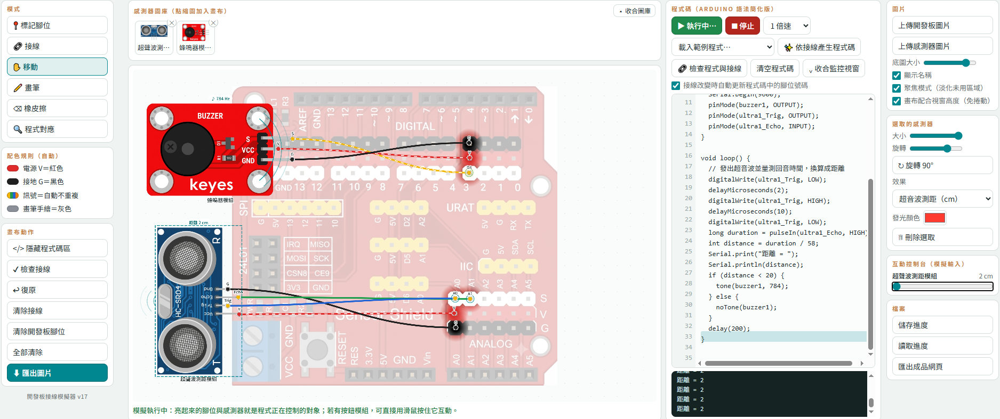

# ⌁ 開發板接線模擬器 — 教學手冊

一個專為國小、國中科技課程設計的**接線與程式模擬工具**：老師上傳開發板與感測器的實際照片、標記腳位，學生就能用點擊的方式模擬杜邦線接線、撰寫 Arduino 程式，並**在螢幕上看到真實的動作效果**——LED 依亮度發光、蜂鳴器出現聲波、伺服馬達轉動、LCD 顯示文字，導線上還有電流流動動畫。

最重要的設計理念：**效果由接線決定**。忘記接 GND 就不會亮，訊號線接錯腳位程式就抓不到。學生必須靠「為什麼沒反應」自己回頭查線路與程式，除錯思維貫穿整個學習過程。

支援 **Arduino、ESP32、micro:bit** 等任何開發板——因為底圖與感測器圖片都由老師自行上傳，不受廠牌限制。

> 單一 HTML 檔案、免安裝、免後端伺服器、可離線使用，電腦與平板觸控皆可操作。

---

## 目錄

1. [快速開始](#一快速開始)
2. [介面配置](#二介面配置)
3. [教師備課流程](#三教師備課流程)
4. [學生使用流程](#四學生使用流程)
5. [感測器效果類型對照表](#五感測器效果類型對照表)
6. [支援的程式語法與函式庫](#六支援的程式語法與函式庫)
7. [接線與程式碼的雙向連動](#七接線與程式碼的雙向連動)
8. [教學活動設計建議](#八教學活動設計建議)
9. [常見問題](#九常見問題)
10. [檔案格式與技術說明](#十檔案格式與技術說明)
11. [版本紀錄](#十一版本紀錄)

---

## 一、快速開始

### 直接開啟

下載 `index.html`，用瀏覽器（建議 Chrome / Edge / Safari）打開即可，**不需要網路**（僅介面字型需連線，離線時自動改用系統字型）。

### 發布到 GitHub Pages（推薦，學生用網址就能開）

1. 建立 GitHub 儲存庫，把模擬器檔案改名為 `index.html` 上傳到根目錄。
2. **Settings → Pages**，Source 選 **Deploy from a branch**，Branch 選 `main`、資料夾選 `/ (root)`，按 Save。
3. 等 Actions 的「pages build and deployment」跑完（deploy 出現綠色勾勾）。
4. 網址即為 `https://<你的帳號>.github.io/<儲存庫名稱>/`，可直接分享給學生。

> 💡 之後每次更新：上傳新檔覆蓋 `index.html` → 等 Actions 綠燈 → 學生端按 `Ctrl + F5` 強制重新整理。

---

## 二、介面配置

三欄式工作台，操作與設定分離：

| 區域 | 內容 |
|------|------|
| **左欄（高頻操作）** | 模式切換（標記腳位／接線／移動／畫筆／橡皮擦／程式對應）、配色規則圖例、畫布動作（顯示程式碼區、檢查接線、復原、清除、匯出圖片） |
| **中欄** | 感測器圖庫、大畫布（內部解析度 1600×800）。開啟程式碼區時，程式碼面板從最上方一路延伸到底，佔用右側整欄 |
| **右欄（設定）** | 圖片上傳與顯示選項（顯示名稱、聚焦模式、畫布配合視窗高度）、選取感測器的屬性（大小／旋轉／效果／發光顏色）、**互動控制台**（模擬輸入）、檔案功能 |

寬度 1000px 以下（平板直式、手機）自動改為單欄，工具區排在畫布上方。

**畫布比例**：勾選「畫布配合視窗高度」時，畫布的長寬比會自動配合可用區域，完整填滿工作區不留空白；取消勾選則固定為 3:2 並以完整寬度顯示。畫布內部座標會等比換算，因此不同螢幕開啟同一份專案，版面比例維持一致。

**畫面高度**：預設勾選「畫布配合視窗高度」，此時**三欄共用同一個高度預算**（都等於「視窗高度 − 標題 − 頁尾」），畫布自動填滿中欄，開啟時不會出現頁面捲軸；某一欄內容較多時，只會在該欄內部出現捲軸。若想要更大的畫布（代價是需要捲動頁面），取消勾選即可。感測器都加好之後，可按圖庫右上的「▴ 收合圖庫」再多讓出約 70px 給畫布。開啟程式碼區時，程式碼面板高度也會限制在視窗內並黏在視窗頂端，長程式用面板內部的捲軸瀏覽；執行模擬時會自動捲到正在執行的那一行。監控視窗可收合，把空間讓給程式碼。

### 快速鍵

| 按鍵 | 功能 |
|------|------|
| `Esc` | 取消進行中的接線 |
| `Delete` / `Backspace` | 刪除選取的感測器 |
| `Tab`（程式碼區內） | 插入兩個空白縮排 |

---

## 三、教師備課流程

### 步驟 1：準備圖片

- **開發板圖片**（右欄「上傳開發板圖片」）：成為固定底圖，可用「底圖大小」滑桿調整，腳位標記會跟著等比縮放。
- **感測器圖片**（右欄「上傳感測器圖片」）：可一次選多張，上傳時逐一命名後進入圖庫。

**拍攝建議**：用課程實際使用的模組，白紙背景、正面俯拍、光線均勻，長邊 1200px 以上、**去背存成 PNG**。學生看到的就是手上那顆，認知落差最小；自己拍也沒有著作權顧慮。針腳要清楚可見，後續標記才精準。

### 步驟 2：標記腳位

切到「📍 標記腳位」模式：

- 點開發板照片上的針腳 → 輸入名稱（如 `5V`、`GND`、`D9`、`A0`）。
- 把感測器加入畫布，點它的針腳 → 輸入名稱（如 `V`、`G`、`S`、`Trig`、`Echo`）。**同款感測器只需標一次**，之後每個放上畫布的都自帶腳位。
- **命名規則決定腳位類型**：含 `V / VCC / VIN / 5V / 3V3` → **電源（紅點）**；含 `G / GND` → **接地（黑點）**；其餘 → **訊號（黃點）**。
- 點已存在的腳位可改名；名稱清空並確定即刪除。換課程配置時按「清除開發板腳位」一鍵清空（感測器腳位會保留）。

### 步驟 3：設定模擬效果

切到「✋ 移動」模式選取感測器，右欄「效果」下拉選單指定類型（詳見[第五節](#五感測器效果類型對照表)）。上傳時系統會**依名稱自動判斷**，多數情況不必手動改。設定屬於「同款感測器」共用，並會存入專案。

### 步驟 4：發布

按右欄「匯出成品網頁」，產生**內嵌所有圖片、腳位、效果設定與起始程式碼**的新 HTML 檔。把它改名 `index.html` 上傳 GitHub 即完成發布——學生打開就有備好的教材，不必自己上傳任何圖片。

> 建議一次建好十幾顆常用模組的完整素材庫再匯出，之後每次上課都從這個檔開始。

---

## 四、學生使用流程

1. **加入模組**：點「感測器圖庫」縮圖加到畫布；「移動」模式拖曳定位，可縮放、旋轉（滑桿或一鍵 90°）。
2. **接線**：「🔗 接線」模式點起點腳位 → 出現跟著游標的預覽線 → 點終點腳位完成。線會吸附腳位，拖曳模組或縮放底圖時自動跟隨。點空白處或 `Esc` 取消。
3. **配色全自動**：電源（V）固定紅色、接地（G）固定黑色、訊號線自動輪流分配不重複的顏色。電源與接地互接（短路）會變紅色虛線並顯示 ⚠。
4. **寫程式**：按「顯示程式碼區」，自行輸入或「載入範例程式」。
5. **執行模擬**：按「▶ 執行」，觀察 LED 發光、蜂鳴器聲波、伺服轉動、導線電流動畫。速度可調 0.5～5 倍。
6. **互動**：右欄「互動控制台」拉滑桿或按切換鈕改變感測器讀值；按鈕模組也可直接在畫布上按住。
7. **檢查與除錯**：「✔ 檢查接線」找短路；「🔗 檢查程式與接線」找出「程式用了但沒接線」「接了線但程式沒用到」「缺少電源或接地」。
8. **繳交**：「⬇ 匯出圖片」下載 PNG，或「儲存進度」保留 `.json` 專案檔下次繼續。

---

## 五、感測器效果類型對照表

### 輸出類（被程式控制）

| 效果 | 適用模組 | 模擬呈現 |
|------|----------|----------|
| **LED 發光** | LED、燈條、雷射、繼電器、風扇、馬達、水泵 | 依 `analogWrite` 值呈現亮度漸變的光暈，顏色可自訂，顯示亮度百分比 |
| **蜂鳴器** | 蜂鳴器、喇叭 | 擴散的聲波動畫，顯示 `tone()` 的頻率 |
| **伺服馬達** | SG90、舵機 | 指針轉動到對應角度，顯示角度數值 |
| **馬達／驅動模組（雙腳位）** | L9110S、L298N、TB6612、N20、TT 齒輪馬達 | 依兩支控制腳判斷正轉／反轉／停止／煞車，顯示旋轉動畫與轉速百分比；接在驅動模組輸出端的馬達會同步轉動 |
| **文字顯示器（LCD）** | LCD1602、OLED、12864 | 綠字液晶畫面，顯示 `lcd.print()` 寫入的文字 |

### 輸入類（可即時互動）

| 效果 | 適用模組 | 互動方式 |
|------|----------|----------|
| **按鈕（按住＝HIGH）** | 按鈕、觸摸開關 | 執行時**按住畫布上的圖片**或控制台按鈕，腳位變 HIGH，放開變 LOW |
| **數位感測器（開關切換）** | PIR 人體紅外、傾斜、震動、避障、循跡、磁簧、霍爾、限位 | 控制台切換鈕，切換 HIGH／LOW |
| **類比感測器（0～1023）** | 光敏、土壤濕度、水位、雨滴、可變電阻、聲音、火焰、煙霧、搖桿 | 控制台滑桿，0～1023 連續調整 |
| **超音波測距（cm）** | HC-SR04、SRF05 | 控制台滑桿調整距離，`pulseIn` 與 `NewPing` 皆可讀到 |
| **溫濕度感測器** | DHT11／DHT22、AM2302 | 控制台雙滑桿分別調整溫度與濕度 |

### 其他

| 效果 | 用途 |
|------|------|
| **一般指示** | 顯示該腳位的 HIGH／LOW 狀態環與數值，適合尚未分類的模組 |
| **無效果** | 純接線示意，不參與模擬 |

> **重要**：所有效果都需要 V 與 G 接好才會動作。輸入感測器沒接電源時讀值為 0，並在畫布上顯示「⚠ 缺少 G（接地）」。這是刻意的教學設計。

---

## 六、支援的程式語法與函式庫

模擬器內建 Arduino 語法簡化解譯器，覆蓋國小到國中專題常用的範圍。

### 基本結構與流程控制

```cpp
void setup() { }          // 開機執行一次
void loop() { }           // 反覆執行
int x = 5;  float f;  long n;  bool b;   // 變數宣告
x = x + 1;  x += 2;  x++;                // 賦值與遞增
if (...) { } else if (...) { } else { }   // 條件判斷
for (int i = 0; i < 8; i++) { }           // for 迴圈
while (i < 3) { }                         // while 迴圈
break;  continue;  return v;              // 流程控制
int myFunc(int a) { return a * 2; }       // 自訂函式（可有回傳值，能用在算式中）
// 單行註解    /* 多行註解 */    #include <...>
```

### 內建指令

| 類別 | 指令 |
|------|------|
| 腳位 | `pinMode(pin, OUTPUT/INPUT/INPUT_PULLUP)`、`digitalWrite(pin, HIGH/LOW)`、`digitalRead(pin)`、`analogWrite(pin, 0~255)`、`analogRead(pin)` |
| 時間 | `delay(ms)`、`delayMicroseconds(us)`、`millis()`、`micros()` |
| 聲音 | `tone(pin, 頻率)`、`noTone(pin)` |
| 量測 | `pulseIn(pin, HIGH)`（超音波回音時間，`÷58` 得 cm） |
| 數學 | `map()`、`constrain()`、`random()`、`abs()`、`min()`、`max()`、`sqrt()`、`pow()`、`sq()`、`sin()`、`cos()`、`floor()`、`ceil()`、`round()` |
| 序列埠 | `Serial.begin()`、`Serial.print()`、`Serial.println()`（輸出顯示在監控視窗） |
| 常數 | `HIGH`、`LOW`、`OUTPUT`、`INPUT`、`INPUT_PULLUP`、`A0`～`A5`、`LED_BUILTIN`、`PI`、`DHT11`、`DHT22`、十六進位如 `0x27` |

### 支援的函式庫寫法

| 函式庫 | 支援的方法 |
|--------|------------|
| `Servo` | `attach(pin)`、`write(角度)`、`writeMicroseconds()`、`read()`、`detach()` |
| `DHT` | `DHT dht(pin, DHT11);`、`begin()`、`readTemperature()`、`readHumidity()` |
| `NewPing` / `Ultrasonic` | `NewPing sonar(trig, echo);`、`ping_cm()`、`ping_in()`、`ping()` |
| `LiquidCrystal_I2C` / `LiquidCrystal` / `Adafruit_SSD1306` | `init()`、`begin()`、`backlight()`、`noBacklight()`、`clear()`、`home()`、`setCursor(欄, 列)`、`print()`、`println()` |
| `LedControl` | `shutdown()`、`setIntensity()`、`clearDisplay()`、`setLed()`、`setRow()`、`setColumn()` |
| `Adafruit_NeoPixel` | `begin()`、`setPixelColor()`、`show()`、`clear()`、`setBrightness()` |
| `SoftwareSerial` | `begin()`、`print()`、`println()` |

### 內建範例程式

LED 閃爍｜LED 呼吸燈｜兩顆 LED 交替｜蜂鳴器嗶嗶聲｜伺服馬達擺動｜按鈕控制 LED（互動）｜光敏偵測自動開燈｜超音波倒車雷達｜溫濕度顯示（函式庫）｜LCD 顯示文字（函式庫）｜**L9110S 馬達正反轉**｜跑馬燈（for 迴圈）

### 馬達控制寫法（L9110S）

```cpp
int motorA1 = 5;   // A-IA
int motorA2 = 6;   // A-IB

// 正轉
digitalWrite(motorA1, HIGH);  digitalWrite(motorA2, LOW);
// 反轉
digitalWrite(motorA1, LOW);   digitalWrite(motorA2, HIGH);
// 停止
digitalWrite(motorA1, LOW);   digitalWrite(motorA2, LOW);
// 半速正轉（PWM 調速）
analogWrite(motorA1, 128);    digitalWrite(motorA2, LOW);
```

### 自由組合範例：光敏偵測開燈

```cpp
int light1 = A0;   // 光敏 AO 接 A0
int led1 = 5;      // LED 的 S 接 D5

void setup() {
  pinMode(led1, OUTPUT);
  Serial.begin(9600);
}

void loop() {
  int value = analogRead(light1);
  Serial.print("光線值 = ");
  Serial.println(value);

  if (value < 400) {          // 太暗
    digitalWrite(led1, HIGH); // 開燈
  } else {                    // 夠亮
    digitalWrite(led1, LOW);  // 關燈
  }
  delay(200);
}
```

執行後拉動控制台的光線滑桿，LED 就會自動亮暗。把光敏換成超音波、把 LED 換成蜂鳴器或伺服馬達，就是全新的專題。

---

## 七、接線與程式碼的雙向連動

這是本工具最核心的教學機制。

### 接線 → 程式碼

- **程式碼是空的時候**：一完成接線就自動寫好整份可執行程式。LED 的 S 接到 D5，程式碼就是 `int led1 = 5;`，連 `pinMode`、`setup`、`loop` 與腳位對照註解都一併產生。
- **程式碼已有內容時**：改接腳位會自動更新號碼（`int led1 = 5;` → `int led1 = 6;`，`servo.attach()` 同步）。可用勾選框關閉此功能。
- **「✨ 依接線產生程式碼」會看組合自動決定邏輯**：
  - 光敏（類比）＋ LED → 門檻判斷式
  - 超音波 ＋ 蜂鳴器 → 完整測距警示（含 Trig／Echo 時序與 `pulseIn`）
  - PIR（數位）＋ 伺服馬達 → 偵測即動作
  - DHT → 溫濕度讀取與條件控制
  - 有 LCD 就自動把數值印到顯示器
  - 需要的 `#include` 與函式庫物件宣告都會一併產生

### 程式碼 → 接線

- 程式碼用到的腳位，畫布上會出現**青色圓環**標記。
- 把游標移到程式碼某一行，該行控制的腳位會在畫布上**閃動**。
- 「🔍 程式對應」模式點畫布上的腳位，程式碼中對應的行會被**黃色標示**。
- 「🔗 檢查程式與接線」列出所有落差：程式用了 D9 但沒接線、D3 接了線但程式沒用到、某模組缺少 G⋯⋯

---

## 八、教學活動設計建議

### 課程節奏：模擬 → 檢核 → 實作

學生先在模擬器完成接線、程式與執行驗證，匯出 PNG 經老師或同儕檢核後，才能領實體材料。大幅減少燒壞模組與搶材料的混亂。

### 活動一：偵錯偵探（推薦作為第一堂）

老師故意接錯幾條線（少接 GND、訊號接錯腳位、電源接到接地）後匯出成品網頁，讓學生分組找出問題，用「檢查接線」與「檢查程式與接線」驗證。**比直接照著接更能檢驗理解**。

### 活動二：一輸入配一輸出

從最單純的配對開始，每組換不同模組就是一個新專題：

| 專題 | 輸入 | 輸出 | 核心概念 |
|------|------|------|----------|
| 自動路燈 | 光敏 | LED | 類比讀值與門檻判斷 |
| 倒車雷達 | 超音波 | 蜂鳴器 | 距離換算、多層條件 |
| 自動門 | PIR 人體紅外 | 伺服馬達 | 數位訊號與角度控制 |
| 智慧風扇 | DHT11 | LED（代表風扇） | 函式庫與浮點數比較 |
| 土壤濕度警報 | 土壤濕度 | 蜂鳴器＋LCD | 多輸出整合 |
| 自走車避障 | 超音波 | L9110S＋N20 馬達 | 雙腳位驅動、正反轉邏輯 |
| 手動遙控車 | 按鈕 | L9110S＋N20 馬達 | 輸入控制輸出、PWM 調速 |

### 活動三：任務卡關卡制

每關一個專案檔（`.json`），Lv1 點亮 LED → Lv2 按鈕控制 → Lv3 光敏自動開燈 → Lv4 倒車雷達，通關蓋章集點。

### 活動四：門檻調查任務

同一個光敏開燈程式，讓學生自行實驗並記錄：門檻設 200／400／600 時，燈在什麼光線值下會亮？把數據填入學習單，自然帶出「校正」與「資料判讀」的概念。

### 活動五：跨板教材庫

Arduino、ESP32、micro:bit 各做一個成品網頁，同一套感測器照片重複使用，未來換板子不用重做教材。

### 安全提醒（務必納入課程）

以此工具進行的活動，別忘了提醒學生：**模擬通過 ≠ 一定正確**。實際接線時要斷電操作、再次核對腳位，養成良好的電路安全習慣。⚡

---

## 九、常見問題

**Q：發布到 GitHub Pages 後網頁沒更新？**
A：先到 Actions 確認「pages build and deployment」已跑完綠燈；再按 `Ctrl + F5` 強制重新整理（Pages 與瀏覽器都有快取）。若 deploy 長時間卡在 Queued，多半是 GitHub 端壅塞，可取消後 Re-run，或查看 [githubstatus.com](https://www.githubstatus.com)。取消工作會留下紅色 error 紀錄，那只是取消記錄，不是失敗。

**Q：程式按了執行卻沒反應？**
A：依序檢查：①該模組的 V 與 G 是否都接好（畫布會顯示「⚠ 缺少 G」）；②訊號腳是否接到程式控制的那支腳位（按「🔗 檢查程式與接線」最快）；③模組的效果類型是否設對；④程式是否寫在 `loop()` 裡。

**Q：換了一張新的開發板照片，腳位還在嗎？**
A：腳位以「相對於底圖」的比例儲存，更換構圖不同的照片後位置會偏移，建議按「清除開發板腳位」重新標記。

**Q：成品網頁檔案會不會太大？**
A：圖片上傳時自動壓縮（底圖長邊 1600px、感測器 900px），一般 1 張底圖＋5～8 顆感測器約 1～3 MB，GitHub 網頁上傳單檔上限 25 MB，綽綽有餘。

**Q：程式碼寫了模擬器不支援的指令怎麼辦？**
A：監控視窗會顯示「尚未支援的指令」並略過該行，其餘程式繼續執行，不會整份中斷。

**Q：平板可以用嗎？**
A：可以，全功能支援觸控。標記腳位需要較精準的點擊，建議搭配觸控筆。

**Q：模擬結果和真實電路一定一樣嗎？**
A：不一定。模擬器忠實反映「接線邏輯」與「程式邏輯」，但不模擬電壓降、電流限制、上拉電阻、感測器誤差與時序精度。它的用途是**接線與程式的邏輯驗證**，不是電路分析。

---

## 十、檔案格式與技術說明

| 檔案 | 說明 |
|------|------|
| `index.html` | 模擬器本體（或已內嵌教材的成品網頁），單一檔案含全部程式與樣式 |
| `接線模擬器專案.json` | 「儲存進度」產生的專案檔，含底圖、感測器圖片（base64）、腳位、接線、效果設定、程式碼與手繪內容 |
| `開發板接線模擬器_成品.html` | 「匯出成品網頁」產生的發布版，已內嵌教材，開啟即用，本身仍具完整功能 |
| `接線圖.png` | 「匯出圖片」產生的高解析度成果圖（3200×1600） |

舊版專案檔可直接被新版讀取（腳位座標會自動轉換為相對格式，效果類型會依名稱自動補上）。

**技術**：純前端 HTML + CSS + Vanilla JavaScript + Canvas 2D，無框架與相依套件；無後端、無資料庫、不蒐集任何資料，所有內容僅存在使用者自己下載的檔案中。相容 Chrome、Edge、Safari、Firefox 近年版本，觸控採 Pointer Events。程式解譯器與效果判定邏輯有 76 項自動化測試。

---

## 十一、版本紀錄

- **v17**：修正核取方塊與說明文字換行、互動控制台說明字級（span 未套用樣式的問題）；左右欄改為等寬並預留捲軸空間。
- **v16**：移除頁尾、版本資訊移至左欄下方，多讓出約 30px 給畫布。
- **v15**：畫布比例自動配合可用區域（完整填滿工作區，預設 3:2）；新增馬達／驅動模組效果（L9110S、L298N 等，支援正反轉、PWM 調速、煞車，N20 馬達可由驅動模組輸出端帶動）。
- **v14**：三欄共用同一高度預算、畫布填滿中欄（修正 v13 量測錯誤導致畫布過小）；感測器圖庫可收合；版面垂直留白壓縮。
- **v13**：新增「畫布配合視窗高度」選項（量測方式於 v14 修正）。
- **v12**：程式碼面板高度限制於視窗內（內部捲軸恆可操作）、監控視窗可收合、執行時自動跟隨目前行。
- **v11**：修正行號對齊、emoji 相容性、選單溢出；程式碼區延伸為整個右欄。
- **v10**：Keyes 常見模組五大類效果（類比／數位／超音波／溫濕度／顯示器）；互動控制台；函式庫語法支援（Servo、DHT、NewPing、LiquidCrystal_I2C、LedControl、NeoPixel、SoftwareSerial）；`pulseIn`、自訂函式回傳值；四個新範例。
- **v9**：接線自動帶入程式碼與腳位同步；按鈕點擊互動；程式碼區移至畫布右側。
- **v8**：程式碼編輯區與 Arduino 簡化解譯器；模擬渲染效果（發光／聲波／轉動／電流動畫）；程式與腳位雙向對應。
- **v7**：畫布擴展至全螢幕寬（1600×800）。
- **v6**：聚焦模式（淡化未標記區域）；感測器旋轉。
- **v5**：三欄式版面。
- **v4**：全自動配色；灰色畫筆；清除開發板腳位。
- **v3**：腳位改為相對座標（隨底圖縮放）；固定側邊工具欄。
- **v2**：腳位標記、點擊式接線、電源／接地錯誤判斷、匯出成品網頁。
- **v1**：上傳圖片、手繪接線、匯出 PNG、專案儲存。

---

## 授權

建議採用 [MIT License](https://opensource.org/licenses/MIT) 釋出，歡迎其他教師自由使用與改作於教學用途。上傳的照片與教材著作權屬於製作者本人。
